# Projects and dependencies analysis

This document provides a comprehensive overview of the projects and their dependencies in the context of upgrading to .NETCoreApp,Version=v10.0.

## Table of Contents

- [Executive Summary](#executive-Summary)
  - [Highlevel Metrics](#highlevel-metrics)
  - [Projects Compatibility](#projects-compatibility)
  - [Package Compatibility](#package-compatibility)
  - [API Compatibility](#api-compatibility)
- [Aggregate NuGet packages details](#aggregate-nuget-packages-details)
- [Top API Migration Challenges](#top-api-migration-challenges)
  - [Technologies and Features](#technologies-and-features)
  - [Most Frequent API Issues](#most-frequent-api-issues)
- [Projects Relationship Graph](#projects-relationship-graph)
- [Project Details](#project-details)

  - [src\Client\Client.Services\Client.Services.csproj](#srcclientclientservicesclientservicescsproj)
  - [src\Client\DevCoreApp.Client\DevCoreApp.Client.csproj](#srcclientdevcoreappclientdevcoreappclientcsproj)
  - [src\Server\Database\Core\Core.csproj](#srcserverdatabasecorecorecsproj)
  - [src\Server\Database\Postgres\Postgres.csproj](#srcserverdatabasepostgrespostgrescsproj)
  - [src\Server\Database\SqlServer\SqlServer.csproj](#srcserverdatabasesqlserversqlservercsproj)
  - [src\Server\Email\MailKit\EmailProcessor.MailKit.csproj](#srcserveremailmailkitemailprocessormailkitcsproj)
  - [src\Server\Email\Processor\EmailProcessor.csproj](#srcserveremailprocessoremailprocessorcsproj)
  - [src\Server\WebService\DevCoreApp.WebService.csproj](#srcserverwebservicedevcoreappwebservicecsproj)
  - [src\Shared\Model\Shared.Model.csproj](#srcsharedmodelsharedmodelcsproj)
  - [src\Shared\Services\Shared.Services.csproj](#srcsharedservicessharedservicescsproj)
  - [src\Shared\Utils\Shared.Utils.csproj](#srcsharedutilssharedutilscsproj)

## Executive Summary

### Highlevel Metrics

| Metric | Count | Status |
| :--- | :---: | :--- |
| Total Projects | 11 | All require upgrade |
| Total NuGet Packages | 36 | 27 need upgrade |
| Total Code Files | 97 |  |
| Total Code Files with Incidents | 24 |  |
| Total Lines of Code | 10236 |  |
| Total Number of Issues | 89 |  |
| Estimated LOC to modify | 33+ | at least 0.3% of codebase |

### Projects Compatibility

| Project | Target Framework | Difficulty | Package Issues | API Issues | Est. LOC Impact | Description |
| :--- | :---: | :---: | :---: | :---: | :---: | :--- |
| [src\Client\Client.Services\Client.Services.csproj](#srcclientclientservicesclientservicescsproj) | net8.0 | 🟢 Low | 4 | 0 |  | ClassLibrary, Sdk Style = True |
| [src\Client\DevCoreApp.Client\DevCoreApp.Client.csproj](#srcclientdevcoreappclientdevcoreappclientcsproj) | net8.0 | 🟢 Low | 7 | 6 | 6+ | AspNetCore, Sdk Style = True |
| [src\Server\Database\Core\Core.csproj](#srcserverdatabasecorecorecsproj) | net8.0 | 🟢 Low | 8 | 2 | 2+ | ClassLibrary, Sdk Style = True |
| [src\Server\Database\Postgres\Postgres.csproj](#srcserverdatabasepostgrespostgrescsproj) | net8.0 | 🟢 Low | 3 | 0 |  | ClassLibrary, Sdk Style = True |
| [src\Server\Database\SqlServer\SqlServer.csproj](#srcserverdatabasesqlserversqlservercsproj) | net8.0 | 🟢 Low | 5 | 0 |  | ClassLibrary, Sdk Style = True |
| [src\Server\Email\MailKit\EmailProcessor.MailKit.csproj](#srcserveremailmailkitemailprocessormailkitcsproj) | net8.0 | 🟢 Low | 2 | 0 |  | ClassLibrary, Sdk Style = True |
| [src\Server\Email\Processor\EmailProcessor.csproj](#srcserveremailprocessoremailprocessorcsproj) | net8.0 | 🟢 Low | 0 | 0 |  | ClassLibrary, Sdk Style = True |
| [src\Server\WebService\DevCoreApp.WebService.csproj](#srcserverwebservicedevcoreappwebservicecsproj) | net8.0 | 🟢 Low | 13 | 25 | 25+ | AspNetCore, Sdk Style = True |
| [src\Shared\Model\Shared.Model.csproj](#srcsharedmodelsharedmodelcsproj) | net8.0 | 🟢 Low | 1 | 0 |  | ClassLibrary, Sdk Style = True |
| [src\Shared\Services\Shared.Services.csproj](#srcsharedservicessharedservicescsproj) | net8.0 | 🟢 Low | 2 | 0 |  | ClassLibrary, Sdk Style = True |
| [src\Shared\Utils\Shared.Utils.csproj](#srcsharedutilssharedutilscsproj) | net8.0 | 🟢 Low | 0 | 0 |  | ClassLibrary, Sdk Style = True |

### Package Compatibility

| Status | Count | Percentage |
| :--- | :---: | :---: |
| ✅ Compatible | 9 | 25.0% |
| ⚠️ Incompatible | 1 | 2.8% |
| 🔄 Upgrade Recommended | 26 | 72.2% |
| ***Total NuGet Packages*** | ***36*** | ***100%*** |

### API Compatibility

| Category | Count | Impact |
| :--- | :---: | :--- |
| 🔴 Binary Incompatible | 1 | High - Require code changes |
| 🟡 Source Incompatible | 8 | Medium - Needs re-compilation and potential conflicting API error fixing |
| 🔵 Behavioral change | 24 | Low - Behavioral changes that may require testing at runtime |
| ✅ Compatible | 39098 |  |
| ***Total APIs Analyzed*** | ***39131*** |  |

## Aggregate NuGet packages details

| Package | Current Version | Suggested Version | Projects | Description |
| :--- | :---: | :---: | :--- | :--- |
| Azure.Identity | 1.13.1 |  | [DevCoreApp.WebService.csproj](#srcserverwebservicedevcoreappwebservicecsproj) [SqlServer.csproj](#srcserverdatabasesqlserversqlservercsproj) | ⚠️NuGet package is deprecated |
| DevInstance.BlazorToolkit | 8.0.1 |  | [DevCoreApp.Client.csproj](#srcclientdevcoreappclientdevcoreappclientcsproj) [Shared.Model.csproj](#srcsharedmodelsharedmodelcsproj) [Shared.Services.csproj](#srcsharedservicessharedservicescsproj) | ✅Compatible |
| DevInstance.LogScope | 1.4.3 |  | [Client.Services.csproj](#srcclientclientservicesclientservicescsproj) [Core.csproj](#srcserverdatabasecorecorecsproj) | ✅Compatible |
| DevInstance.LogScope.Extensions.MicrosoftLogger | 8.0.0 |  | [DevCoreApp.WebService.csproj](#srcserverwebservicedevcoreappwebservicecsproj) | ✅Compatible |
| DevInstance.LogScope.NET | 8.0.1 |  | [DevCoreApp.Client.csproj](#srcclientdevcoreappclientdevcoreappclientcsproj) | ✅Compatible |
| DevInstance.WebServiceToolkit | 8.0.0 |  | [DevCoreApp.WebService.csproj](#srcserverwebservicedevcoreappwebservicecsproj) | ✅Compatible |
| DevInstance.WebServiceToolkit.Database | 8.0.1 |  | [Core.csproj](#srcserverdatabasecorecorecsproj) | ✅Compatible |
| FluentValidation | 11.11.0 |  | [DevCoreApp.Client.csproj](#srcclientdevcoreappclientdevcoreappclientcsproj) | ✅Compatible |
| MailKit | 4.9.0 |  | [EmailProcessor.MailKit.csproj](#srcserveremailmailkitemailprocessormailkitcsproj) | ✅Compatible |
| Microsoft.AspNetCore.Components.Authorization | 8.0.11 | 10.0.1 | [Client.Services.csproj](#srcclientclientservicesclientservicescsproj) [DevCoreApp.Client.csproj](#srcclientdevcoreappclientdevcoreappclientcsproj) [DevCoreApp.WebService.csproj](#srcserverwebservicedevcoreappwebservicecsproj) | NuGet package upgrade is recommended |
| Microsoft.AspNetCore.Components.WebAssembly | 8.0.11 | 10.0.1 | [DevCoreApp.Client.csproj](#srcclientdevcoreappclientdevcoreappclientcsproj) [DevCoreApp.WebService.csproj](#srcserverwebservicedevcoreappwebservicecsproj) | NuGet package upgrade is recommended |
| Microsoft.AspNetCore.Components.WebAssembly.Authentication | 8.0.11 | 10.0.1 | [DevCoreApp.Client.csproj](#srcclientdevcoreappclientdevcoreappclientcsproj) [DevCoreApp.WebService.csproj](#srcserverwebservicedevcoreappwebservicecsproj) | NuGet package upgrade is recommended |
| Microsoft.AspNetCore.Components.WebAssembly.Server | 8.0.11 | 10.0.1 | [DevCoreApp.WebService.csproj](#srcserverwebservicedevcoreappwebservicecsproj) | NuGet package upgrade is recommended |
| Microsoft.AspNetCore.Diagnostics.EntityFrameworkCore | 8.0.11 | 10.0.1 | [DevCoreApp.WebService.csproj](#srcserverwebservicedevcoreappwebservicecsproj) | NuGet package upgrade is recommended |
| Microsoft.AspNetCore.Diagnostics.EntityFrameworkCore | 8.0.8 | 10.0.1 | [Core.csproj](#srcserverdatabasecorecorecsproj) | NuGet package upgrade is recommended |
| Microsoft.AspNetCore.Identity.EntityFrameworkCore | 8.0.11 | 10.0.1 | [DevCoreApp.WebService.csproj](#srcserverwebservicedevcoreappwebservicecsproj) | NuGet package upgrade is recommended |
| Microsoft.AspNetCore.Identity.EntityFrameworkCore | 8.0.8 | 10.0.1 | [Core.csproj](#srcserverdatabasecorecorecsproj) | NuGet package upgrade is recommended |
| Microsoft.EntityFrameworkCore | 8.0.8 | 10.0.1 | [Core.csproj](#srcserverdatabasecorecorecsproj) | NuGet package upgrade is recommended |
| Microsoft.EntityFrameworkCore.Design | 8.0.8 | 10.0.1 | [Core.csproj](#srcserverdatabasecorecorecsproj) | NuGet package upgrade is recommended |
| Microsoft.EntityFrameworkCore.SqlServer | 8.0.11 | 10.0.1 | [SqlServer.csproj](#srcserverdatabasesqlserversqlservercsproj) | NuGet package upgrade is recommended |
| Microsoft.EntityFrameworkCore.SqlServer | 9.0.0 | 10.0.1 | [DevCoreApp.WebService.csproj](#srcserverwebservicedevcoreappwebservicecsproj) | NuGet package upgrade is recommended |
| Microsoft.EntityFrameworkCore.Tools | 8.0.11 | 10.0.1 | [SqlServer.csproj](#srcserverdatabasesqlserversqlservercsproj) | NuGet package upgrade is recommended |
| Microsoft.EntityFrameworkCore.Tools | 8.0.8 | 10.0.1 | [Core.csproj](#srcserverdatabasecorecorecsproj) | NuGet package upgrade is recommended |
| Microsoft.EntityFrameworkCore.Tools | 9.0.0 | 10.0.1 | [DevCoreApp.WebService.csproj](#srcserverwebservicedevcoreappwebservicecsproj) | NuGet package upgrade is recommended |
| Microsoft.Extensions.Configuration.Abstractions | 8.0.0 | 10.0.1 | [EmailProcessor.MailKit.csproj](#srcserveremailmailkitemailprocessormailkitcsproj) | NuGet package upgrade is recommended |
| Microsoft.Extensions.Configuration.Abstractions | 9.0.0 | 10.0.1 | [Core.csproj](#srcserverdatabasecorecorecsproj) [Postgres.csproj](#srcserverdatabasepostgrespostgrescsproj) [Shared.Model.csproj](#srcsharedmodelsharedmodelcsproj) [Shared.Services.csproj](#srcsharedservicessharedservicescsproj) [SqlServer.csproj](#srcserverdatabasesqlserversqlservercsproj) | NuGet package upgrade is recommended |
| Microsoft.Extensions.DependencyInjection.Abstractions | 9.0.0 | 10.0.1 | [Client.Services.csproj](#srcclientclientservicesclientservicescsproj) [Core.csproj](#srcserverdatabasecorecorecsproj) [DevCoreApp.Client.csproj](#srcclientdevcoreappclientdevcoreappclientcsproj) [DevCoreApp.WebService.csproj](#srcserverwebservicedevcoreappwebservicecsproj) [EmailProcessor.MailKit.csproj](#srcserveremailmailkitemailprocessormailkitcsproj) [Postgres.csproj](#srcserverdatabasepostgrespostgrescsproj) [Shared.Services.csproj](#srcsharedservicessharedservicescsproj) [SqlServer.csproj](#srcserverdatabasesqlserversqlservercsproj) | NuGet package upgrade is recommended |
| Microsoft.Extensions.Http | 8.0.1 | 10.0.1 | [Client.Services.csproj](#srcclientclientservicesclientservicescsproj) [DevCoreApp.Client.csproj](#srcclientdevcoreappclientdevcoreappclientcsproj) | NuGet package upgrade is recommended |
| Microsoft.Extensions.Identity.Core | 8.0.8 | 10.0.1 | [Core.csproj](#srcserverdatabasecorecorecsproj) | NuGet package upgrade is recommended |
| Microsoft.Extensions.Localization | 8.0.11 | 10.0.1 | [DevCoreApp.Client.csproj](#srcclientdevcoreappclientdevcoreappclientcsproj) | NuGet package upgrade is recommended |
| Microsoft.Extensions.Localization | 9.0.0 | 10.0.1 | [DevCoreApp.WebService.csproj](#srcserverwebservicedevcoreappwebservicecsproj) | NuGet package upgrade is recommended |
| Microsoft.Extensions.Localization.Abstractions | 8.0.11 | 10.0.1 | [Client.Services.csproj](#srcclientclientservicesclientservicescsproj) [DevCoreApp.Client.csproj](#srcclientdevcoreappclientdevcoreappclientcsproj) | NuGet package upgrade is recommended |
| Microsoft.Extensions.Localization.Abstractions | 9.0.0 | 10.0.1 | [DevCoreApp.WebService.csproj](#srcserverwebservicedevcoreappwebservicecsproj) | NuGet package upgrade is recommended |
| Microsoft.Extensions.Options | 9.0.0 | 10.0.1 | [Postgres.csproj](#srcserverdatabasepostgrespostgrescsproj) | NuGet package upgrade is recommended |
| Npgsql.EntityFrameworkCore.PostgreSQL | 9.0.2 |  | [Postgres.csproj](#srcserverdatabasepostgrespostgrescsproj) | ✅Compatible |
| System.Text.Json | 9.0.0 | 10.0.1 | [DevCoreApp.WebService.csproj](#srcserverwebservicedevcoreappwebservicecsproj) | NuGet package upgrade is recommended |

## Top API Migration Challenges

### Technologies and Features

| Technology | Issues | Percentage | Migration Path |
| :--- | :---: | :---: | :--- |

### Most Frequent API Issues

| API | Count | Percentage | Category |
| :--- | :---: | :---: | :--- |
| T:System.Uri | 14 | 42.4% | Behavioral Change |
| P:System.Uri.AbsoluteUri | 7 | 21.2% | Behavioral Change |
| T:Microsoft.Extensions.DependencyInjection.IdentityEntityFrameworkBuilderExtensions | 1 | 3.0% | Source Incompatible |
| M:Microsoft.Extensions.DependencyInjection.IdentityEntityFrameworkBuilderExtensions.AddEntityFrameworkStores''1(Microsoft.AspNetCore.Identity.IdentityBuilder) | 1 | 3.0% | Source Incompatible |
| M:System.Uri.#ctor(System.String) | 1 | 3.0% | Behavioral Change |
| M:Microsoft.Extensions.DependencyInjection.HttpClientFactoryServiceCollectionExtensions.AddHttpClient(Microsoft.Extensions.DependencyInjection.IServiceCollection,System.String,System.Action{System.Net.Http.HttpClient}) | 1 | 3.0% | Behavioral Change |
| M:System.TimeSpan.FromHours(System.Double) | 1 | 3.0% | Source Incompatible |
| M:System.TimeSpan.FromMinutes(System.Double) | 1 | 3.0% | Source Incompatible |
| M:Microsoft.Extensions.Configuration.ConfigurationBinder.GetValue(Microsoft.Extensions.Configuration.IConfiguration,System.Type,System.String) | 1 | 3.0% | Binary Incompatible |
| M:Microsoft.AspNetCore.Builder.ExceptionHandlerExtensions.UseExceptionHandler(Microsoft.AspNetCore.Builder.IApplicationBuilder,System.String) | 1 | 3.0% | Behavioral Change |
| T:Microsoft.AspNetCore.Builder.MigrationsEndPointExtensions | 1 | 3.0% | Source Incompatible |
| M:Microsoft.AspNetCore.Builder.MigrationsEndPointExtensions.UseMigrationsEndPoint(Microsoft.AspNetCore.Builder.IApplicationBuilder) | 1 | 3.0% | Source Incompatible |
| T:Microsoft.Extensions.DependencyInjection.DatabaseDeveloperPageExceptionFilterServiceExtensions | 1 | 3.0% | Source Incompatible |
| M:Microsoft.Extensions.DependencyInjection.DatabaseDeveloperPageExceptionFilterServiceExtensions.AddDatabaseDeveloperPageExceptionFilter(Microsoft.Extensions.DependencyInjection.IServiceCollection) | 1 | 3.0% | Source Incompatible |

## Projects Relationship Graph

Legend:
📦 SDK-style project
⚙️ Classic project

```mermaid
flowchart LR
    P1["<b>📦&nbsp;DevCoreApp.Client.csproj</b><br/><small>net8.0</small>"]
    P2["<b>📦&nbsp;DevCoreApp.WebService.csproj</b><br/><small>net8.0</small>"]
    P3["<b>📦&nbsp;Client.Services.csproj</b><br/><small>net8.0</small>"]
    P4["<b>📦&nbsp;Core.csproj</b><br/><small>net8.0</small>"]
    P5["<b>📦&nbsp;Postgres.csproj</b><br/><small>net8.0</small>"]
    P6["<b>📦&nbsp;SqlServer.csproj</b><br/><small>net8.0</small>"]
    P7["<b>📦&nbsp;Shared.Model.csproj</b><br/><small>net8.0</small>"]
    P8["<b>📦&nbsp;Shared.Utils.csproj</b><br/><small>net8.0</small>"]
    P9["<b>📦&nbsp;EmailProcessor.MailKit.csproj</b><br/><small>net8.0</small>"]
    P10["<b>📦&nbsp;EmailProcessor.csproj</b><br/><small>net8.0</small>"]
    P11["<b>📦&nbsp;Shared.Services.csproj</b><br/><small>net8.0</small>"]
    P1 --> P3
    P2 --> P6
    P2 --> P1
    P2 --> P4
    P2 --> P5
    P2 --> P8
    P2 --> P10
    P2 --> P7
    P3 --> P11
    P3 --> P8
    P3 --> P7
    P4 --> P7
    P4 --> P8
    P5 --> P4
    P6 --> P4
    P9 --> P10
    P11 --> P7
    click P1 "#srcclientdevcoreappclientdevcoreappclientcsproj"
    click P2 "#srcserverwebservicedevcoreappwebservicecsproj"
    click P3 "#srcclientclientservicesclientservicescsproj"
    click P4 "#srcserverdatabasecorecorecsproj"
    click P5 "#srcserverdatabasepostgrespostgrescsproj"
    click P6 "#srcserverdatabasesqlserversqlservercsproj"
    click P7 "#srcsharedmodelsharedmodelcsproj"
    click P8 "#srcsharedutilssharedutilscsproj"
    click P9 "#srcserveremailmailkitemailprocessormailkitcsproj"
    click P10 "#srcserveremailprocessoremailprocessorcsproj"
    click P11 "#srcsharedservicessharedservicescsproj"

```

## Project Details

### src\Client\Client.Services\Client.Services.csproj

#### Project Info

- **Current Target Framework:** net8.0
- **Proposed Target Framework:** net10.0
- **SDK-style**: True
- **Project Kind:** ClassLibrary
- **Dependencies**: 3
- **Dependants**: 1
- **Number of Files**: 9
- **Number of Files with Incidents**: 1
- **Lines of Code**: 311
- **Estimated LOC to modify**: 0+ (at least 0.0% of the project)

#### Dependency Graph

Legend:
📦 SDK-style project
⚙️ Classic project

```mermaid
flowchart TB
    subgraph upstream["Dependants (1)"]
        P1["<b>📦&nbsp;DevCoreApp.Client.csproj</b><br/><small>net8.0</small>"]
        click P1 "#srcclientdevcoreappclientdevcoreappclientcsproj"
    end
    subgraph current["Client.Services.csproj"]
        MAIN["<b>📦&nbsp;Client.Services.csproj</b><br/><small>net8.0</small>"]
        click MAIN "#srcclientclientservicesclientservicescsproj"
    end
    subgraph downstream["Dependencies (3"]
        P11["<b>📦&nbsp;Shared.Services.csproj</b><br/><small>net8.0</small>"]
        P8["<b>📦&nbsp;Shared.Utils.csproj</b><br/><small>net8.0</small>"]
        P7["<b>📦&nbsp;Shared.Model.csproj</b><br/><small>net8.0</small>"]
        click P11 "#srcsharedservicessharedservicescsproj"
        click P8 "#srcsharedutilssharedutilscsproj"
        click P7 "#srcsharedmodelsharedmodelcsproj"
    end
    P1 --> MAIN
    MAIN --> P11
    MAIN --> P8
    MAIN --> P7

```

### API Compatibility

| Category | Count | Impact |
| :--- | :---: | :--- |
| 🔴 Binary Incompatible | 0 | High - Require code changes |
| 🟡 Source Incompatible | 0 | Medium - Needs re-compilation and potential conflicting API error fixing |
| 🔵 Behavioral change | 0 | Low - Behavioral changes that may require testing at runtime |
| ✅ Compatible | 412 |  |
| ***Total APIs Analyzed*** | ***412*** |  |

### src\Client\DevCoreApp.Client\DevCoreApp.Client.csproj

#### Project Info

- **Current Target Framework:** net8.0
- **Proposed Target Framework:** net10.0
- **SDK-style**: True
- **Project Kind:** AspNetCore
- **Dependencies**: 1
- **Dependants**: 1
- **Number of Files**: 26
- **Number of Files with Incidents**: 4
- **Lines of Code**: 472
- **Estimated LOC to modify**: 6+ (at least 1.3% of the project)

#### Dependency Graph

Legend:
📦 SDK-style project
⚙️ Classic project

```mermaid
flowchart TB
    subgraph upstream["Dependants (1)"]
        P2["<b>📦&nbsp;DevCoreApp.WebService.csproj</b><br/><small>net8.0</small>"]
        click P2 "#srcserverwebservicedevcoreappwebservicecsproj"
    end
    subgraph current["DevCoreApp.Client.csproj"]
        MAIN["<b>📦&nbsp;DevCoreApp.Client.csproj</b><br/><small>net8.0</small>"]
        click MAIN "#srcclientdevcoreappclientdevcoreappclientcsproj"
    end
    subgraph downstream["Dependencies (1"]
        P3["<b>📦&nbsp;Client.Services.csproj</b><br/><small>net8.0</small>"]
        click P3 "#srcclientclientservicesclientservicescsproj"
    end
    P2 --> MAIN
    MAIN --> P3

```

### API Compatibility

| Category | Count | Impact |
| :--- | :---: | :--- |
| 🔴 Binary Incompatible | 0 | High - Require code changes |
| 🟡 Source Incompatible | 0 | Medium - Needs re-compilation and potential conflicting API error fixing |
| 🔵 Behavioral change | 6 | Low - Behavioral changes that may require testing at runtime |
| ✅ Compatible | 2576 |  |
| ***Total APIs Analyzed*** | ***2582*** |  |

### src\Server\Database\Core\Core.csproj

#### Project Info

- **Current Target Framework:** net8.0
- **Proposed Target Framework:** net10.0
- **SDK-style**: True
- **Project Kind:** ClassLibrary
- **Dependencies**: 2
- **Dependants**: 3
- **Number of Files**: 17
- **Number of Files with Incidents**: 2
- **Lines of Code**: 643
- **Estimated LOC to modify**: 2+ (at least 0.3% of the project)

#### Dependency Graph

Legend:
📦 SDK-style project
⚙️ Classic project

```mermaid
flowchart TB
    subgraph upstream["Dependants (3)"]
        P2["<b>📦&nbsp;DevCoreApp.WebService.csproj</b><br/><small>net8.0</small>"]
        P5["<b>📦&nbsp;Postgres.csproj</b><br/><small>net8.0</small>"]
        P6["<b>📦&nbsp;SqlServer.csproj</b><br/><small>net8.0</small>"]
        click P2 "#srcserverwebservicedevcoreappwebservicecsproj"
        click P5 "#srcserverdatabasepostgrespostgrescsproj"
        click P6 "#srcserverdatabasesqlserversqlservercsproj"
    end
    subgraph current["Core.csproj"]
        MAIN["<b>📦&nbsp;Core.csproj</b><br/><small>net8.0</small>"]
        click MAIN "#srcserverdatabasecorecorecsproj"
    end
    subgraph downstream["Dependencies (2"]
        P7["<b>📦&nbsp;Shared.Model.csproj</b><br/><small>net8.0</small>"]
        P8["<b>📦&nbsp;Shared.Utils.csproj</b><br/><small>net8.0</small>"]
        click P7 "#srcsharedmodelsharedmodelcsproj"
        click P8 "#srcsharedutilssharedutilscsproj"
    end
    P2 --> MAIN
    P5 --> MAIN
    P6 --> MAIN
    MAIN --> P7
    MAIN --> P8

```

### API Compatibility

| Category | Count | Impact |
| :--- | :---: | :--- |
| 🔴 Binary Incompatible | 0 | High - Require code changes |
| 🟡 Source Incompatible | 2 | Medium - Needs re-compilation and potential conflicting API error fixing |
| 🔵 Behavioral change | 0 | Low - Behavioral changes that may require testing at runtime |
| ✅ Compatible | 914 |  |
| ***Total APIs Analyzed*** | ***916*** |  |

### src\Server\Database\Postgres\Postgres.csproj

#### Project Info

- **Current Target Framework:** net8.0
- **Proposed Target Framework:** net10.0
- **SDK-style**: True
- **Project Kind:** ClassLibrary
- **Dependencies**: 1
- **Dependants**: 1
- **Number of Files**: 8
- **Number of Files with Incidents**: 1
- **Lines of Code**: 3545
- **Estimated LOC to modify**: 0+ (at least 0.0% of the project)

#### Dependency Graph

Legend:
📦 SDK-style project
⚙️ Classic project

```mermaid
flowchart TB
    subgraph upstream["Dependants (1)"]
        P2["<b>📦&nbsp;DevCoreApp.WebService.csproj</b><br/><small>net8.0</small>"]
        click P2 "#srcserverwebservicedevcoreappwebservicecsproj"
    end
    subgraph current["Postgres.csproj"]
        MAIN["<b>📦&nbsp;Postgres.csproj</b><br/><small>net8.0</small>"]
        click MAIN "#srcserverdatabasepostgrespostgrescsproj"
    end
    subgraph downstream["Dependencies (1"]
        P4["<b>📦&nbsp;Core.csproj</b><br/><small>net8.0</small>"]
        click P4 "#srcserverdatabasecorecorecsproj"
    end
    P2 --> MAIN
    MAIN --> P4

```

### API Compatibility

| Category | Count | Impact |
| :--- | :---: | :--- |
| 🔴 Binary Incompatible | 0 | High - Require code changes |
| 🟡 Source Incompatible | 0 | Medium - Needs re-compilation and potential conflicting API error fixing |
| 🔵 Behavioral change | 0 | Low - Behavioral changes that may require testing at runtime |
| ✅ Compatible | 11702 |  |
| ***Total APIs Analyzed*** | ***11702*** |  |

### src\Server\Database\SqlServer\SqlServer.csproj

#### Project Info

- **Current Target Framework:** net8.0
- **Proposed Target Framework:** net10.0
- **SDK-style**: True
- **Project Kind:** ClassLibrary
- **Dependencies**: 1
- **Dependants**: 1
- **Number of Files**: 8
- **Number of Files with Incidents**: 1
- **Lines of Code**: 3504
- **Estimated LOC to modify**: 0+ (at least 0.0% of the project)

#### Dependency Graph

Legend:
📦 SDK-style project
⚙️ Classic project

```mermaid
flowchart TB
    subgraph upstream["Dependants (1)"]
        P2["<b>📦&nbsp;DevCoreApp.WebService.csproj</b><br/><small>net8.0</small>"]
        click P2 "#srcserverwebservicedevcoreappwebservicecsproj"
    end
    subgraph current["SqlServer.csproj"]
        MAIN["<b>📦&nbsp;SqlServer.csproj</b><br/><small>net8.0</small>"]
        click MAIN "#srcserverdatabasesqlserversqlservercsproj"
    end
    subgraph downstream["Dependencies (1"]
        P4["<b>📦&nbsp;Core.csproj</b><br/><small>net8.0</small>"]
        click P4 "#srcserverdatabasecorecorecsproj"
    end
    P2 --> MAIN
    MAIN --> P4

```

### API Compatibility

| Category | Count | Impact |
| :--- | :---: | :--- |
| 🔴 Binary Incompatible | 0 | High - Require code changes |
| 🟡 Source Incompatible | 0 | Medium - Needs re-compilation and potential conflicting API error fixing |
| 🔵 Behavioral change | 0 | Low - Behavioral changes that may require testing at runtime |
| ✅ Compatible | 11680 |  |
| ***Total APIs Analyzed*** | ***11680*** |  |

### src\Server\Email\MailKit\EmailProcessor.MailKit.csproj

#### Project Info

- **Current Target Framework:** net8.0
- **Proposed Target Framework:** net10.0
- **SDK-style**: True
- **Project Kind:** ClassLibrary
- **Dependencies**: 1
- **Dependants**: 0
- **Number of Files**: 2
- **Number of Files with Incidents**: 1
- **Lines of Code**: 67
- **Estimated LOC to modify**: 0+ (at least 0.0% of the project)

#### Dependency Graph

Legend:
📦 SDK-style project
⚙️ Classic project

```mermaid
flowchart TB
    subgraph current["EmailProcessor.MailKit.csproj"]
        MAIN["<b>📦&nbsp;EmailProcessor.MailKit.csproj</b><br/><small>net8.0</small>"]
        click MAIN "#srcserveremailmailkitemailprocessormailkitcsproj"
    end
    subgraph downstream["Dependencies (1"]
        P10["<b>📦&nbsp;EmailProcessor.csproj</b><br/><small>net8.0</small>"]
        click P10 "#srcserveremailprocessoremailprocessorcsproj"
    end
    MAIN --> P10

```

### API Compatibility

| Category | Count | Impact |
| :--- | :---: | :--- |
| 🔴 Binary Incompatible | 0 | High - Require code changes |
| 🟡 Source Incompatible | 0 | Medium - Needs re-compilation and potential conflicting API error fixing |
| 🔵 Behavioral change | 0 | Low - Behavioral changes that may require testing at runtime |
| ✅ Compatible | 122 |  |
| ***Total APIs Analyzed*** | ***122*** |  |

### src\Server\Email\Processor\EmailProcessor.csproj

#### Project Info

- **Current Target Framework:** net8.0
- **Proposed Target Framework:** net10.0
- **SDK-style**: True
- **Project Kind:** ClassLibrary
- **Dependencies**: 0
- **Dependants**: 2
- **Number of Files**: 6
- **Number of Files with Incidents**: 1
- **Lines of Code**: 112
- **Estimated LOC to modify**: 0+ (at least 0.0% of the project)

#### Dependency Graph

Legend:
📦 SDK-style project
⚙️ Classic project

```mermaid
flowchart TB
    subgraph upstream["Dependants (2)"]
        P2["<b>📦&nbsp;DevCoreApp.WebService.csproj</b><br/><small>net8.0</small>"]
        P9["<b>📦&nbsp;EmailProcessor.MailKit.csproj</b><br/><small>net8.0</small>"]
        click P2 "#srcserverwebservicedevcoreappwebservicecsproj"
        click P9 "#srcserveremailmailkitemailprocessormailkitcsproj"
    end
    subgraph current["EmailProcessor.csproj"]
        MAIN["<b>📦&nbsp;EmailProcessor.csproj</b><br/><small>net8.0</small>"]
        click MAIN "#srcserveremailprocessoremailprocessorcsproj"
    end
    P2 --> MAIN
    P9 --> MAIN

```

### API Compatibility

| Category | Count | Impact |
| :--- | :---: | :--- |
| 🔴 Binary Incompatible | 0 | High - Require code changes |
| 🟡 Source Incompatible | 0 | Medium - Needs re-compilation and potential conflicting API error fixing |
| 🔵 Behavioral change | 0 | Low - Behavioral changes that may require testing at runtime |
| ✅ Compatible | 124 |  |
| ***Total APIs Analyzed*** | ***124*** |  |

### src\Server\WebService\DevCoreApp.WebService.csproj

#### Project Info

- **Current Target Framework:** net8.0
- **Proposed Target Framework:** net10.0
- **SDK-style**: True
- **Project Kind:** AspNetCore
- **Dependencies**: 7
- **Dependants**: 0
- **Number of Files**: 75
- **Number of Files with Incidents**: 10
- **Lines of Code**: 1206
- **Estimated LOC to modify**: 25+ (at least 2.1% of the project)

#### Dependency Graph

Legend:
📦 SDK-style project
⚙️ Classic project

```mermaid
flowchart TB
    subgraph current["DevCoreApp.WebService.csproj"]
        MAIN["<b>📦&nbsp;DevCoreApp.WebService.csproj</b><br/><small>net8.0</small>"]
        click MAIN "#srcserverwebservicedevcoreappwebservicecsproj"
    end
    subgraph downstream["Dependencies (7"]
        P6["<b>📦&nbsp;SqlServer.csproj</b><br/><small>net8.0</small>"]
        P1["<b>📦&nbsp;DevCoreApp.Client.csproj</b><br/><small>net8.0</small>"]
        P4["<b>📦&nbsp;Core.csproj</b><br/><small>net8.0</small>"]
        P5["<b>📦&nbsp;Postgres.csproj</b><br/><small>net8.0</small>"]
        P8["<b>📦&nbsp;Shared.Utils.csproj</b><br/><small>net8.0</small>"]
        P10["<b>📦&nbsp;EmailProcessor.csproj</b><br/><small>net8.0</small>"]
        P7["<b>📦&nbsp;Shared.Model.csproj</b><br/><small>net8.0</small>"]
        click P6 "#srcserverdatabasesqlserversqlservercsproj"
        click P1 "#srcclientdevcoreappclientdevcoreappclientcsproj"
        click P4 "#srcserverdatabasecorecorecsproj"
        click P5 "#srcserverdatabasepostgrespostgrescsproj"
        click P8 "#srcsharedutilssharedutilscsproj"
        click P10 "#srcserveremailprocessoremailprocessorcsproj"
        click P7 "#srcsharedmodelsharedmodelcsproj"
    end
    MAIN --> P6
    MAIN --> P1
    MAIN --> P4
    MAIN --> P5
    MAIN --> P8
    MAIN --> P10
    MAIN --> P7

```

### API Compatibility

| Category | Count | Impact |
| :--- | :---: | :--- |
| 🔴 Binary Incompatible | 1 | High - Require code changes |
| 🟡 Source Incompatible | 6 | Medium - Needs re-compilation and potential conflicting API error fixing |
| 🔵 Behavioral change | 18 | Low - Behavioral changes that may require testing at runtime |
| ✅ Compatible | 11124 |  |
| ***Total APIs Analyzed*** | ***11149*** |  |

### src\Shared\Model\Shared.Model.csproj

#### Project Info

- **Current Target Framework:** net8.0
- **Proposed Target Framework:** net10.0
- **SDK-style**: True
- **Project Kind:** ClassLibrary
- **Dependencies**: 0
- **Dependants**: 4
- **Number of Files**: 10
- **Number of Files with Incidents**: 1
- **Lines of Code**: 227
- **Estimated LOC to modify**: 0+ (at least 0.0% of the project)

#### Dependency Graph

Legend:
📦 SDK-style project
⚙️ Classic project

```mermaid
flowchart TB
    subgraph upstream["Dependants (4)"]
        P2["<b>📦&nbsp;DevCoreApp.WebService.csproj</b><br/><small>net8.0</small>"]
        P3["<b>📦&nbsp;Client.Services.csproj</b><br/><small>net8.0</small>"]
        P4["<b>📦&nbsp;Core.csproj</b><br/><small>net8.0</small>"]
        P11["<b>📦&nbsp;Shared.Services.csproj</b><br/><small>net8.0</small>"]
        click P2 "#srcserverwebservicedevcoreappwebservicecsproj"
        click P3 "#srcclientclientservicesclientservicescsproj"
        click P4 "#srcserverdatabasecorecorecsproj"
        click P11 "#srcsharedservicessharedservicescsproj"
    end
    subgraph current["Shared.Model.csproj"]
        MAIN["<b>📦&nbsp;Shared.Model.csproj</b><br/><small>net8.0</small>"]
        click MAIN "#srcsharedmodelsharedmodelcsproj"
    end
    P2 --> MAIN
    P3 --> MAIN
    P4 --> MAIN
    P11 --> MAIN

```

### API Compatibility

| Category | Count | Impact |
| :--- | :---: | :--- |
| 🔴 Binary Incompatible | 0 | High - Require code changes |
| 🟡 Source Incompatible | 0 | Medium - Needs re-compilation and potential conflicting API error fixing |
| 🔵 Behavioral change | 0 | Low - Behavioral changes that may require testing at runtime |
| ✅ Compatible | 269 |  |
| ***Total APIs Analyzed*** | ***269*** |  |

### src\Shared\Services\Shared.Services.csproj

#### Project Info

- **Current Target Framework:** net8.0
- **Proposed Target Framework:** net10.0
- **SDK-style**: True
- **Project Kind:** ClassLibrary
- **Dependencies**: 1
- **Dependants**: 1
- **Number of Files**: 5
- **Number of Files with Incidents**: 1
- **Lines of Code**: 99
- **Estimated LOC to modify**: 0+ (at least 0.0% of the project)

#### Dependency Graph

Legend:
📦 SDK-style project
⚙️ Classic project

```mermaid
flowchart TB
    subgraph upstream["Dependants (1)"]
        P3["<b>📦&nbsp;Client.Services.csproj</b><br/><small>net8.0</small>"]
        click P3 "#srcclientclientservicesclientservicescsproj"
    end
    subgraph current["Shared.Services.csproj"]
        MAIN["<b>📦&nbsp;Shared.Services.csproj</b><br/><small>net8.0</small>"]
        click MAIN "#srcsharedservicessharedservicescsproj"
    end
    subgraph downstream["Dependencies (1"]
        P7["<b>📦&nbsp;Shared.Model.csproj</b><br/><small>net8.0</small>"]
        click P7 "#srcsharedmodelsharedmodelcsproj"
    end
    P3 --> MAIN
    MAIN --> P7

```

### API Compatibility

| Category | Count | Impact |
| :--- | :---: | :--- |
| 🔴 Binary Incompatible | 0 | High - Require code changes |
| 🟡 Source Incompatible | 0 | Medium - Needs re-compilation and potential conflicting API error fixing |
| 🔵 Behavioral change | 0 | Low - Behavioral changes that may require testing at runtime |
| ✅ Compatible | 137 |  |
| ***Total APIs Analyzed*** | ***137*** |  |

### src\Shared\Utils\Shared.Utils.csproj

#### Project Info

- **Current Target Framework:** net8.0
- **Proposed Target Framework:** net10.0
- **SDK-style**: True
- **Project Kind:** ClassLibrary
- **Dependencies**: 0
- **Dependants**: 3
- **Number of Files**: 3
- **Number of Files with Incidents**: 1
- **Lines of Code**: 50
- **Estimated LOC to modify**: 0+ (at least 0.0% of the project)

#### Dependency Graph

Legend:
📦 SDK-style project
⚙️ Classic project

```mermaid
flowchart TB
    subgraph upstream["Dependants (3)"]
        P2["<b>📦&nbsp;DevCoreApp.WebService.csproj</b><br/><small>net8.0</small>"]
        P3["<b>📦&nbsp;Client.Services.csproj</b><br/><small>net8.0</small>"]
        P4["<b>📦&nbsp;Core.csproj</b><br/><small>net8.0</small>"]
        click P2 "#srcserverwebservicedevcoreappwebservicecsproj"
        click P3 "#srcclientclientservicesclientservicescsproj"
        click P4 "#srcserverdatabasecorecorecsproj"
    end
    subgraph current["Shared.Utils.csproj"]
        MAIN["<b>📦&nbsp;Shared.Utils.csproj</b><br/><small>net8.0</small>"]
        click MAIN "#srcsharedutilssharedutilscsproj"
    end
    P2 --> MAIN
    P3 --> MAIN
    P4 --> MAIN

```

### API Compatibility

| Category | Count | Impact |
| :--- | :---: | :--- |
| 🔴 Binary Incompatible | 0 | High - Require code changes |
| 🟡 Source Incompatible | 0 | Medium - Needs re-compilation and potential conflicting API error fixing |
| 🔵 Behavioral change | 0 | Low - Behavioral changes that may require testing at runtime |
| ✅ Compatible | 38 |  |
| ***Total APIs Analyzed*** | ***38*** |  |

